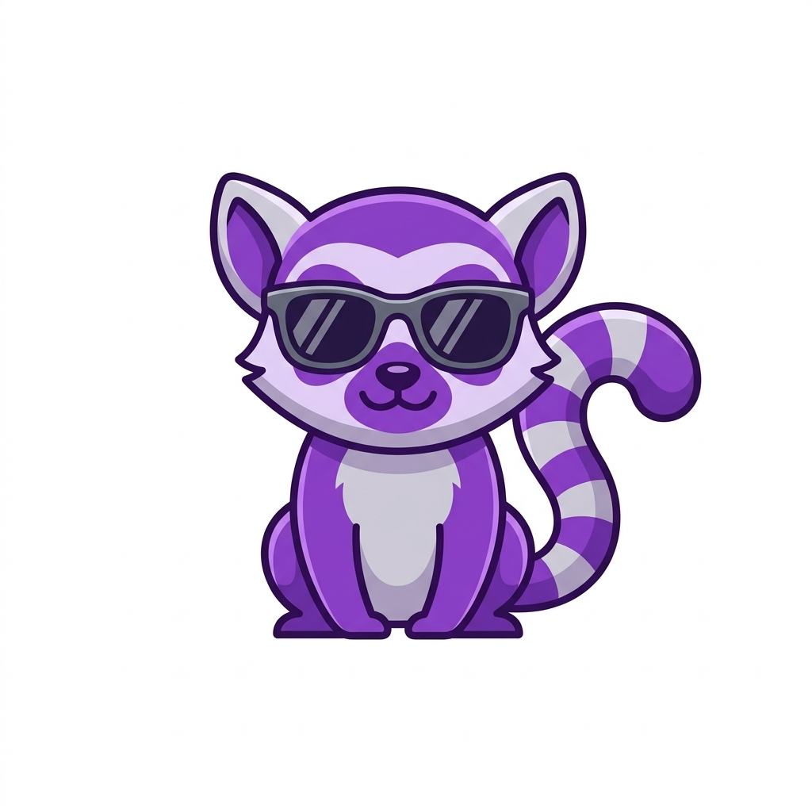

<p align="center">
  
</p>

<h1 align="center">ChromAI — Your Intelligent Browser Copilot</h1>

<p align="center">
  <strong>A powerful Chrome extension that brings agentic AI directly into your browsing experience.</strong>
</p>

<p align="center">
  
  
  
</p>

---

ChromAI is a Chrome extension that opens a sleek right sidebar with a sophisticated AI chat interface. Built on the [lemura](https://github.com/rzafiamy/lemura) framework, it runs a full ReAct loop with a suite of specialized browser tools, allowing the agent to read, navigate, and interact with any webpage just like a human would.

## 🚀 Features

- **⚡ Instant Access:** Integrated Chrome Side Panel for seamless interaction without leaving your current tab.
- **🧠 Agentic Intelligence:** Uses a ReAct loop to think, plan, and execute multi-step tasks.
- **🌐 Provider Agnostic:** Connect to any OpenAI-compatible endpoint (OpenAI, Groq, Together AI, Ollama, LM Studio, etc.).
- **🛠️ Rich Toolset:** The agent can click, scroll, fill forms, extract data, and even wait for asynchronous elements.
- **🔍 Visual Feedback:** Real-time highlighting of elements the agent is interacting with.
- **⚙️ Customizable:** Easy-to-use settings for API keys, model selection, and custom endpoints.

## 🛠 Browser Tools

The agent is equipped with a comprehensive set of tools to master the DOM:

| Category | Tool | Description |
| :--- | :--- | :--- |
| **Read** | `getPageContent` | Captures visible text, page title, and current URL. |
| | `getPageMeta` | Extracts SEO metadata (OpenGraph tags, descriptions, etc.). |
| | `getSelectedText` | Retrieves text currently highlighted by the user. |
| **Interact** | `clickElement` | Performs clicks on elements identified by CSS selectors. |
| | `fillForm` | Populates input fields using native events (React/Vue compatible). |
| | `submitForm` | Submits forms or triggers submit buttons. |
| | `scrollPage` | Dynamic scrolling (up, down, or to specific elements). |
| **Data** | `extractLinks` | Gathers all links or scoped links from a specific section. |
| | `extractTable` | Parses structured table data into machine-readable formats. |
| **Control** | `highlightElement` | Visually outlines elements to show agent focus. |
| | `waitForElement` | Handles async loading by waiting for specific DOM elements. |

## 📦 Setup & Installation

### Prerequisites

- **Node.js** (v18 or higher)
- **Chrome** or any Chromium-based browser (Edge, Brave, etc.)

### 1. Build the Extension

```bash
# Install dependencies
npm install

# Build the production bundle
npm run build
```

The build process generates a `dist/` folder containing the ready-to-load extension.

### 2. Load in Chrome

1. Navigate to `chrome://extensions/` in your browser.
2. Enable **Developer mode** (toggle in the top right).
3. Click **Load unpacked** and select the `dist/` folder from this project.
4. Pin the **ChromAI** icon to your toolbar for easy access.

### 3. Configure Your Agent

Open the ChromAI sidebar and click the **⚙ (Settings)** icon:

- **Base URL:** Your API endpoint (e.g., `https://api.openai.com/v1`).
- **API Key:** Your secret token.
- **Model:** The specific model identifier (e.g., `gpt-4o-mini`, `llama3`, `claude-3-5-sonnet`).

## 🏗 Project Architecture

```text
chromai/
├── public/                  # Static assets & Manifest
│   ├── manifest.json        # Extension configuration (MV3)
│   ├── sidebar.html/css     # Side panel UI & Styling
│   └── icons/               # Brand assets (Lemura icons)
├── src/
│   ├── background/          # Extension service worker (lifecycle management)
│   ├── content/             # DOM Executor (runs in the context of webpages)
│   ├── sidebar/             # Core Logic: Agent wiring, Tool execution, Chat UI
│   └── settings/            # Configuration management logic
├── scripts/                 # Custom build and bundling scripts
└── vite.config.js           # Build configuration
```

## 🔄 How It Works

1. **User Interaction:** You send a natural language request via the sidebar.
2. **Decision Loop:** The **lemura SessionManager** initiates a ReAct cycle, consulting the LLM.
3. **Tool Selection:** The LLM selects the most appropriate browser tool to fulfill the request.
4. **Execution:** The sidebar sends a message to the **content script** in the active tab.
5. **DOM Action:** The content script performs the action (e.g., clicking a button) and returns the outcome.
6. **Observation:** The result is fed back to the LLM to inform its next step.
7. **Completion:** Once the goal is met, the final answer is presented in the chat.

## 🧪 Development

For local development with hot-reloading:

```bash
npm run dev
```

*Note: You still need to refresh the extension in `chrome://extensions` to see changes to the background script or manifest.*

## 📜 License

Distributed under the **MIT License**. See `LICENSE` for more information.

---

<p align="center">
  Built with ❤️ for the future of agentic browsing.
</p>
